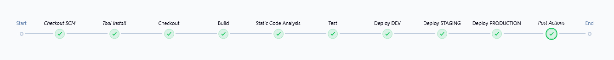
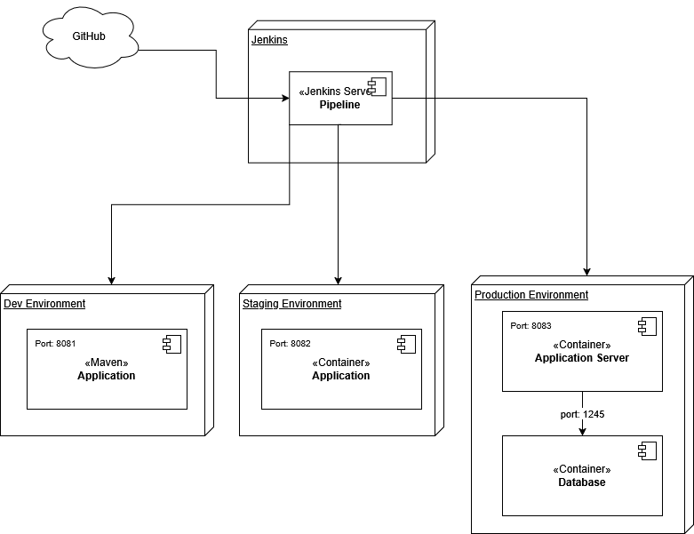
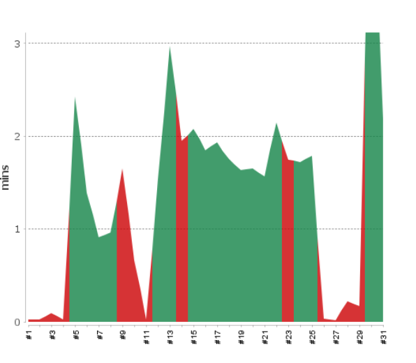
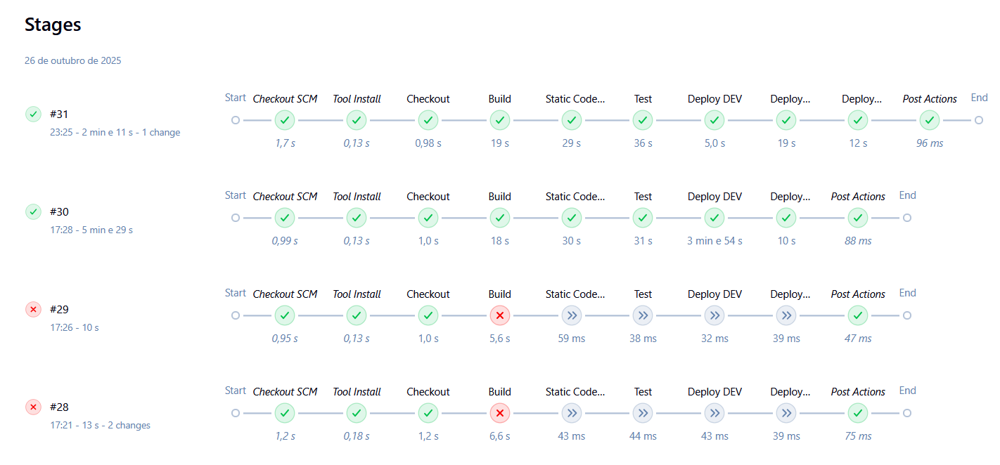

# Application Deployment Architecture & CI/CD Pipeline 

## Overview 
This document describes the deployment architecture and CI/CD pipeline for the Java application `psoft-g1`, managed via Jenkins with multi-environment deployments: **Development**, **Staging**, and **Production**. 

The pipeline automates build, testing (unit, integration, mutation), static analysis, and deployment steps using **Maven**, **Docker**, and **Docker Compose**, ensuring code quality and continuous delivery.

 ---

## CI/CD Overview ### 
 
 Jenkinsfile Summary 

 **Pipeline Type:** Declarative 

 **Parameters:** 
 We used ```groovy DEPLOY_MODE = ['dev', 'staging', 'prod', 'all'] ``` that allowed selective or full-environment deployment so we can have more granularity on what we want to deploy. 

 --- 

 ## Pipeline Stages 
 
 ### 1. Checkout 
 - Retrieves the latest source code from the Git repository (`checkout scm`). 
 
 --- 
 
 ### 2. Build - Navigates to the project directory `psoft-project-2024-g1`. 
 - Builds the application using: ```bash mvn clean package -DskipTests ``` 
 - Produces a JAR file at: ``` psoft-project-2024-g1/target/psoft-g1-0.0.1-SNAPSHOT.jar ``` 
 
 ---
 
 ### 3. Static Code Analysis - Runs **Checkstyle** and **SpotBugs**: 
 ```bash mvn checkstyle:check spotbugs:spotbugs -DskipTests ``` 

 Reports are recorded using Jenkins’ **recordIssues** plugin:
 - `checkstyle-result.xml` 
 - `spotbugsXml.xml` 
 
 --- 
 
 ### 4. Unit Tests 
 
 - Executes: ```bash mvn test ``` 
 - Collects reports from: ``` target/surefire-reports/*.xml ``` 
 - Measures code coverage with **JaCoCo**, enforcing quality gates: 
 - Line coverage ≥ 10% (unstable below threshold) 
 - Branch coverage ≥ 2% (unstable below threshold) 
 
 --- 
 
 ### 5. Mutation Testing 
 - Executes: ```bash mvn pitest:mutationCoverage ``` 
 - Generates **mutation testing reports** in: ``` target/pit-reports/index.html ``` 
 - Jenkins publishes them as an HTML report. 
 
 ---
 
 ### 6. Integration Tests 
 - Runs: ```bash mvn verify ``` 
 - Collects results from: ``` target/failsafe-reports/*.xml ``` 
 - Validates end-to-end logic and API integration. 
 
 --- 
 
 ### 7. Deployment Stages 
 
 #### **Deploy DEV** 
 
 **Trigger:** `DEPLOY_MODE == 'dev'` or `'all'` 
 - Checks for any running process on port `8081` and terminates it. 
 - Runs the app directly via Java: ```bash java -jar psoft-g1-0.0.1-SNAPSHOT.jar --spring.profiles.active=dev ``` 
 - Redirects logs to `dev_app.log`. 

 **Environment Details:** 
 - Local deployment on Jenkins agent or developer machine. 
 - H2 file-based database. - Accessible at: ``` http://localhost:8081 ``` 
 
 --- 
 
 #### **Deploy STAGING** 
 **Trigger:** `DEPLOY_MODE == 'staging'` or `'all'` 

 - Uses **Docker Compose** with service name `psoft-staging`. 
 - Commands: ```bash docker-compose down psoft-staging || true docker-compose build psoft-staging docker-compose up -d psoft-staging ``` 
 - Application runs in a single container (Java app + embedded H2 DB). 

 **Environment Details:** 
 - Exposed on port `8082`. 
 - Used for integration and pre-production testing.

 **Access:** ``` http://localhost:8082 ``` 
 
 --- 
 
 #### **Deploy PRODUCTION** 
 
 **Trigger:** `DEPLOY_MODE == 'prod'` or `'all'`
  - Deploys via Docker Compose with service name `psoft-prod`. 
  - Commands: ```bash docker-compose down psoft-prod || true docker-compose build docker-compose up -d psoft-prod ``` 
  - Starts two containers: 
    1. App Container — runs the Spring Boot application. 
    2. Database Container — runs the dedicated DB (H2 or external). 

 **Ports:** 
 - Application: `8083` 
 - H2 Console: `8084` 

 **Access:** ``` http://localhost:8083 ``` 

---

 #### **Pipeline Flow**

 <p align="center">
  
</p>
 
 --- 
 
 ## Environment Architecture 
 | Environment | Deployment Type | Components | Port(s) | Database | Deployment Method |
 |----------------|-------------------------|---------------------------|------------|--------------------|-------------------------------------------| 
 | Development | Local (JAR via Maven) | Java App | 8081 | H2 (file mode) | Jenkins local exec |
 | Staging | Docker (single container)| Java App + H2 | 8082 | Embedded H2 | `docker-compose up psoft-staging` |
 | Production | Docker (multi-container)| Java App + DB | 8083, 8084 | Dedicated DB | `docker-compose up psoft-prod` | 

---

### Deployment Diagram (System-To-Be)

<p align="center">
  
</p>

---

### Build Time Evidences

<p align="center">
  
</p>

<p align="center">
  
</p>

---

## Quality Gates & Reporting 
| Stage | Tool | Output | Jenkins Integration |
|--------------------|-----------------------|----------------------|---------------------|
| Static Analysis | Checkstyle / SpotBugs | XML reports | `recordIssues` |
| Unit Tests | JUnit | Surefire XML | `junit` | | Coverage | JaCoCo | HTML + XML | `recordCoverage` |
| Mutation Testing | PIT | HTML report | `publishHTML` |
| Integration Tests | Failsafe | XML | `junit` | 
