# Application Deployment Architecture & CI/CD Pipeline 

## Overview 
This document describes the deployment architecture and CI/CD pipeline for the Java application `psoft-g1`, managed via Jenkins with multi-environment deployments: **Development**, **Staging**, and **Production**. 

The pipeline automates build, testing (unit, integration, mutation), static analysis, and deployment steps using **Maven**, **Docker**, and **Docker Compose**, ensuring code quality and continuous delivery.

 ---

## CI/CD Overview ### 
 
 Jenkinsfile Summary 

 **Pipeline Type:** Declarative 

 **Parameters:** 
 We used ```groovy DEPLOY_MODE = ['dev', 'staging', 'prod', 'all'] ``` that allowed selective or full-environment deployment so we can have more granularity on what we want to deploy. 

 --- 

 ## Pipeline Stages 
 
 ### 1. Checkout 
 - Retrieves the latest source code from the Git repository (`checkout scm`). 
 
 --- 
 
 ### 2. Build - Navigates to the project directory `psoft-project-2024-g1`. 
 - Builds the application using: ```bash mvn clean package -DskipTests ``` 

 ---
 
 ### 3. Static Code Analysis - Runs **Checkstyle** and **SpotBugs**: 
 Executes ```bash mvn checkstyle:check spotbugs:spotbugs -DskipTests ```

**Checkstyle** – Analyzes the source code for style guideline compliance (e.g., naming conventions, formatting, and best practices).

**SpotBugs** – Scans the bytecode to identify potential bugs, performance issues, and bad practices in Java code.

 Reports are recorded using Jenkins’ **recordIssues** plugin:
 - `checkstyle-result.xml` 
 - `spotbugsXml.xml` 
 
 --- 

### 4. Packaging
- Executes ```bash mvn package -DskipTests ```
- Produces a JAR file at: ``` psoft-project-2024-g1/target/psoft-g1-0.0.1-SNAPSHOT.jar ```

 --- 
 
 ### 5. Unit Tests 
 
 - Executes: ```bash mvn test ``` 
 - Collects reports from: ``` target/surefire-reports/*.xml ``` 
 - Measures code coverage with **JaCoCo**, enforcing quality gates: 
 - Line coverage ≥ 10% (unstable below threshold) 
 - Branch coverage ≥ 2% (unstable below threshold) 

Although the current thresholds are intentionally low to ensure pipeline stability during early development, ideal quality gates for a mature project would be:
- Line coverage ≥ 80%
- Branch coverage ≥ 70%
 --- 
 
 ### 6. Mutation Testing 
 - Executes: ```bash mvn pitest:mutationCoverage ``` 
 - Measures code coverage with **PIT** plugin
 - Generates **mutation testing reports** in: ``` target/pit-reports/index.html ``` 
 - Jenkins publishes them as an HTML report
 
 ---
 
 ### 7. Integration Tests 
 - Runs: ```bash mvn verify ``` 
 - Collects results from: ``` target/failsafe-reports/*.xml ``` 
 - Validates end-to-end logic and API integration. 
 
 --- 
 
 ### 8. Deployment Stages 
 
 #### **Deploy DEV** 
 
 **Trigger:** `DEPLOY_MODE == 'dev'` or `'all'` 
 - Checks for any running process on port `8081` and terminates it. 
 - Runs the app directly via Java: ```bash java -jar psoft-g1-0.0.1-SNAPSHOT.jar --spring.profiles.active=dev ``` 
 - Redirects logs to `dev_app.log`. 

 **Environment Details:** 
 - Local deployment on Jenkins agent or developer machine. 
 - H2 file-based database. - Accessible at: ``` http://localhost:8081 ``` 
 
 --- 
 
 #### **Deploy STAGING** 
 **Trigger:** `DEPLOY_MODE == 'staging'` or `'all'` 

 - Uses **Docker Compose** with service name `psoft-staging`. 
 - Commands: ```bash docker-compose down psoft-staging || true docker-compose build psoft-staging docker-compose up -d psoft-staging ``` 
 - Application runs in a single container (Java app + embedded H2 DB). 

 **Environment Details:** 
 - Exposed on port `8082`. 
 - Used for integration and pre-production testing.

 **Access:** ``` http://localhost:8082 ``` 
 
 --- 
 
 #### **Deploy PRODUCTION** 
 
 **Trigger:** `DEPLOY_MODE == 'prod'` or `'all'`
  - Deploys via Docker Compose with service name `psoft-prod`. 
  - Commands: ```bash docker-compose down psoft-prod || true docker-compose build docker-compose up -d psoft-prod ``` 
  - Starts two containers: 
    1. App Container — runs the Spring Boot application. 
    2. Database Container — runs the dedicated DB (H2 or external). 

 **Ports:** 
 - Application: `8083` 
 - H2 Console: `8084` 

 **Access:** ``` http://localhost:8083 ``` 

---

 #### **Pipeline Flow**

 <p align="center">
  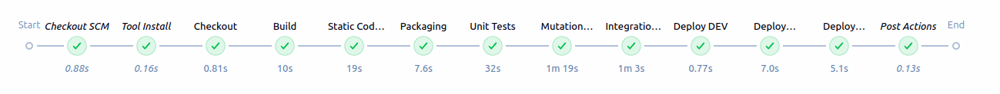
</p>
 
 --- 
 
 ## Environment Architecture 

For our system, we opted to create a Jenkins pipeline that handles deployments to different environments. 
- In the development environment, the application is deployed locally by running the usual Maven commands. 
- For staging, we deploy the application inside a Docker container. 
- In production, we use two Docker containers: one running our Java application and another running the H2 database.

 | Environment | Deployment Type | Components | Port(s) | Database | Deployment Method |
 |----------------|-------------------------|---------------------------|------------|--------------------|-------------------------------------------| 
 | Development | Local (JAR via Maven) | Java App | 8081 | H2 (file mode) | Jenkins local exec |
 | Staging | Docker (single container)| Java App + H2 | 8082 | Embedded H2 | `docker-compose up psoft-staging` |
 | Production | Docker (multi-container)| Java App + DB | 8083, 8084 | Dedicated DB | `docker-compose up psoft-prod` | 


---

### Deployment Diagram (System-To-Be)

<p align="center">
  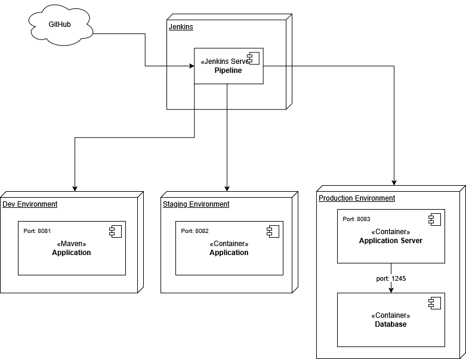
</p>

To meet the project objectives, we decided to use two Jenkins instances: one running locally on a machine, and another running inside a container. 
For the locally installed Jenkins, we had to install all required plugins manually via the command line.
With the Jenkins container setup, however, we could predefine the plugins we wanted. 
This approach ensures that when the Jenkins UI is first opened, all necessary plugins are already installed and configured, allowing our team to maintain a consistent setup across environments.

An important configuration for both the local and containerized Jenkins instances is the environment variable:
`-Dhudson.util.ProcessTree.disable=true"`

This configuration allows Jenkins to run containers and commands within the workspace safely, ensuring that child processes do not remain running after the workspace finishes.

To start using the containerized Jenkins, we ran the following command inside the psoft-project-2024-g1/jenkins folder:
`docker-compose up -d`

---

#### Development Environment
<p align="center">
  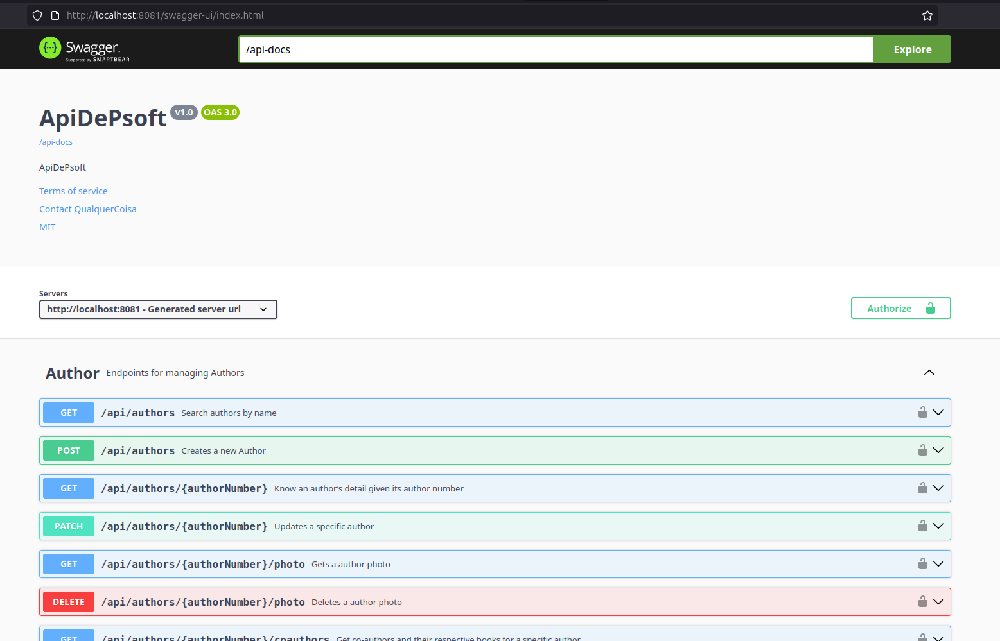
</p>

---

#### Staging Environment
<p align="center">
  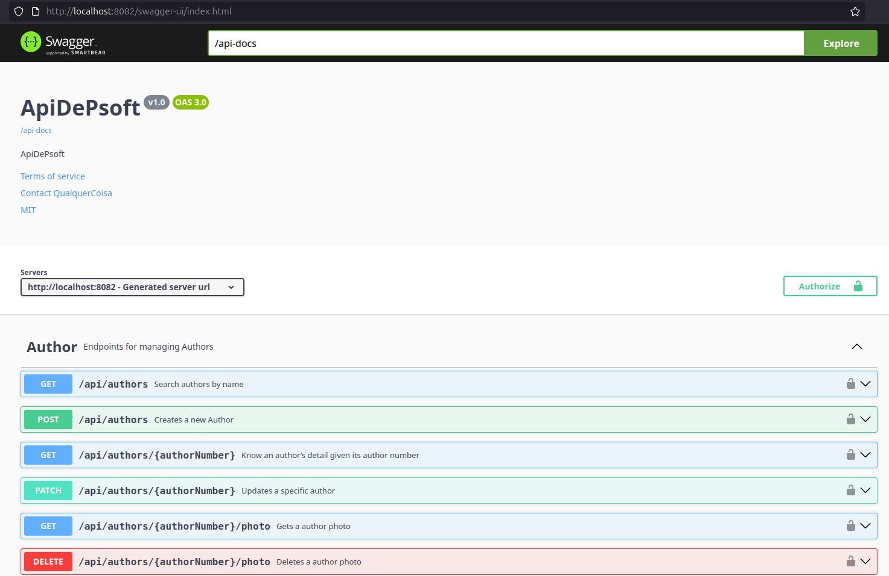
</p>

---

#### Production Environment

<p align="center">
  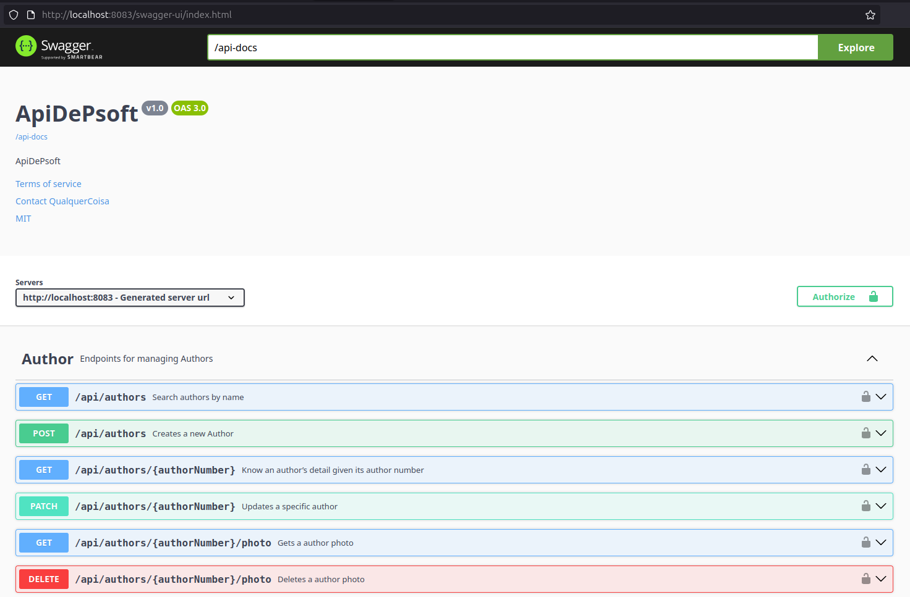
</p>
(Application)

<p align="center">
  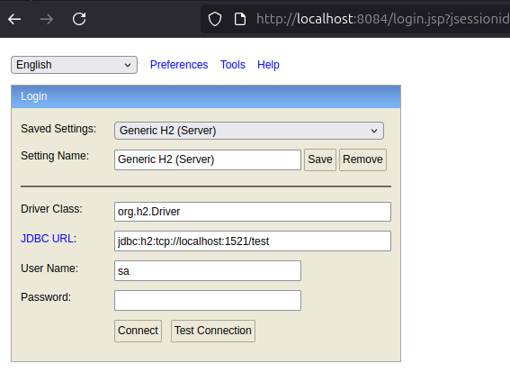
</p>
(Database)

#### Containers Evidence

<p align="center">
  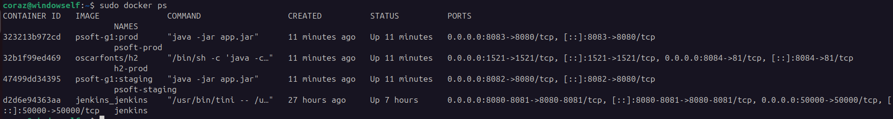
</p>

---

### Build Time Evidences

At the beginning of the development process, the continuous integration pipeline included only the essential stages: **Checkout**, **Build**, and **Unit Test**.
This setup ensured that the project could be successfully compiled and that the basic unit tests ran correctly, providing minimal code validation with each commit.
As shown in figure below, the total execution time of this initial pipeline was approximately **1 minute and 23 seconds**, reflecting a simple and lightweight structure suitable for the early phases of the project.
However, this configuration presented significant limitations in terms of test quality and coverage, as it did not include static analysis, coverage measurement, or mutation testing.

Over time, the pipeline evolved significantly, integrating new stages such as **Static Code Analysis**, **Code Coverage Measurement**, and **Mutation Testing**.
These additions introduced deeper quality checks, allowing the detection of stylistic inconsistencies, potential bugs, and weaknesses in the test suite.
Consequently, the pipeline transitioned from a simple verification tool into a more complete Continuous Integration and Quality Assurance process.

Finally, deployment stages were added, enabling automated delivery of the application to different environments — **DEV**, **STAGING**, and **PRODUCTION** — using a mix of direct execution and Docker Compose.
This enhancement allowed for faster validation of new builds in realistic environments, supporting incremental testing, pre-production validation, and smoother production rollouts.
Although these improvements naturally increased the overall execution time of the pipeline, they provided a much higher level of confidence in both the code quality and the deployment reliability.

##### Initial Pipeline:
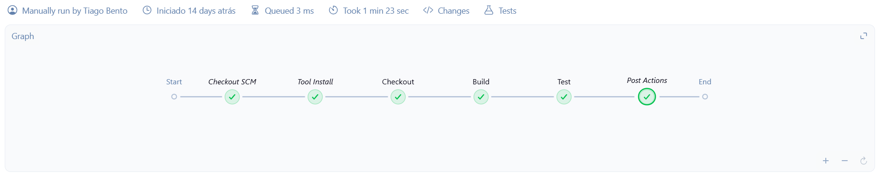

<p align="center">
  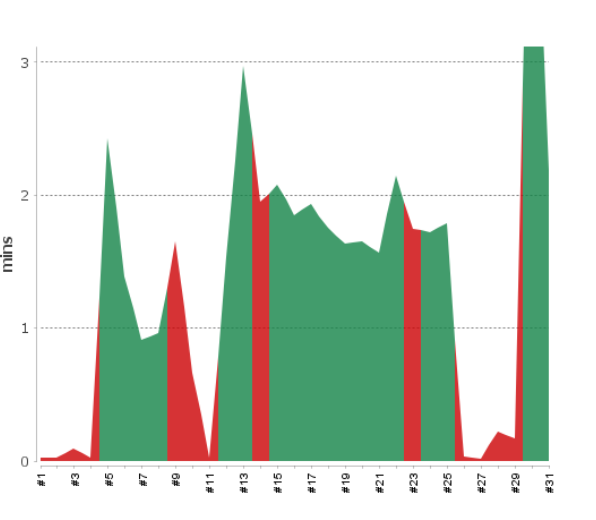
</p>
(Graph took from Jenkins Pipeline in localhost)

---

##### Pipeline (26/10/2025):
<p align="center">
  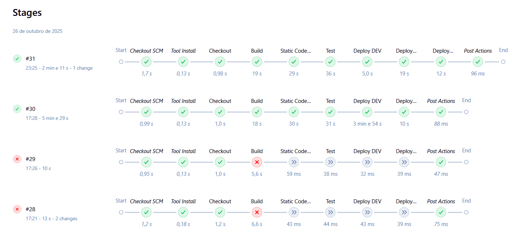
</p>

---

##### Pipeline Final
<p align="center">
  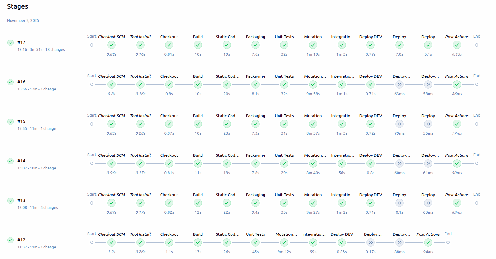
</p>

<p align="center">
  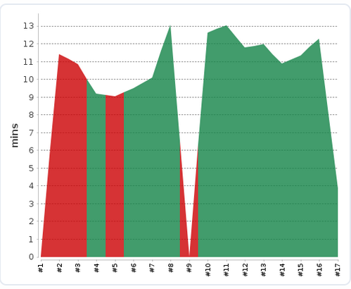
</p>

(Graph took from Jenkins Pipeline in container)

---

One important remark, previously, our mutation tests took an average of **about 9 minutes and 16 seconds**. 
By restricting the tests to the domain layer, the execution time dropped to just **1 minute and 19 seconds**, representing an approximately **86% reduction**. 
This dramatically improved the speed and efficiency of our CI/CD pipeline.

<p align="center">
  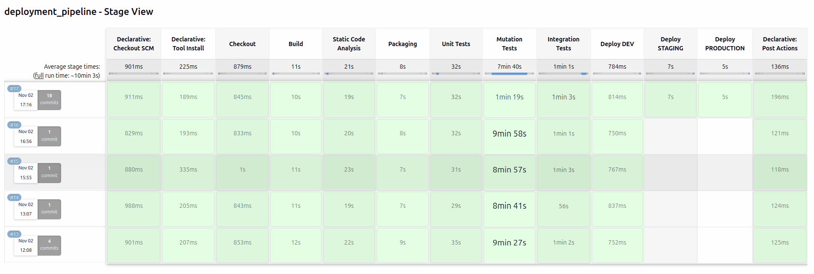
</p>


---

## Quality Gates & Reporting 
| Stage | Tool | Output | Jenkins Integration |
|--------------------|-----------------------|----------------------|---------------------|
| Static Analysis | Checkstyle / SpotBugs | XML reports | `recordIssues` |
| Unit Tests | JUnit | Surefire XML | `junit` | | Coverage | JaCoCo | HTML + XML | `recordCoverage` |
| Mutation Testing | PIT | HTML report | `publishHTML` |
| Integration Tests | Failsafe | XML | `junit` | 

---

## Test Health: Quantity and Quality

This section evaluates the overall health of the test suite before and after improvements, focusing on both quantity (coverage metrics) and quality (test design and effectiveness).

### Before Improvements

JaCoCo Coverage Reports:
- Line coverage: 20.15%
- Branch coverage: 4.65%

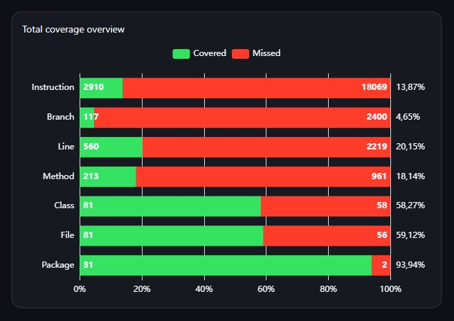

PIT Mutation Testing (Model Package):
- Mutation coverage: 39%
- Test strength: 72%

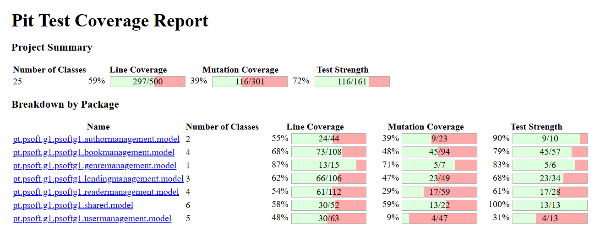

Test Quality:
- Existing tests often covered multiple classes simultaneously, rather than focusing on a single System Under Test (SUT).
- Tests lacked proper isolation of dependencies, which led to inconsistent and unreliable outcomes.

- As a result, the test suite provided low confidence in software correctness.
Although some code was exercised, the lack of true unit-level focus and poor assertion depth limited the suite’s diagnostic power.

### After Improvements

JaCoCo Coverage Reports (Expected):
- Line coverage: ≈ X% 
- Branch coverage: ≈ Y%

PIT Mutation Testing (Model Package):
- Mutation coverage: 66%
- Test strength: 86%

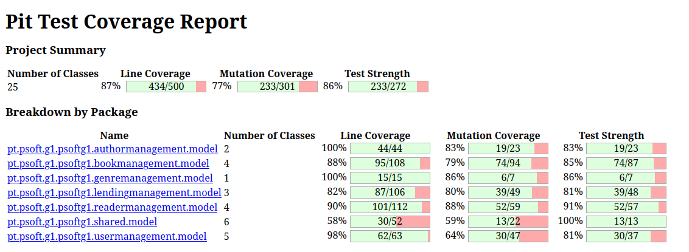

Test Quality:
- Each test now targets a single SUT, ensuring proper unit isolation and more consistent results.
- Mocking frameworks were introduced to decouple dependencies.
- Mutation testing was used iteratively to identify weak tests and strengthen them.
- These improvements led to a substantial increase in mutation coverage, indicating that a larger portion of the codebase is now effectively validated by meaningful tests.
