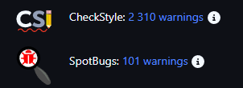
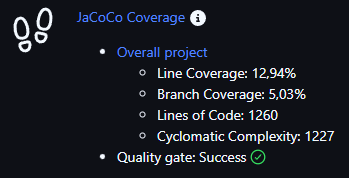
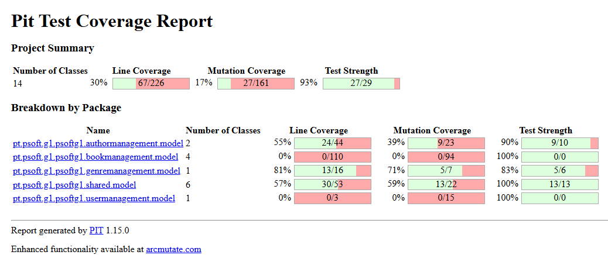
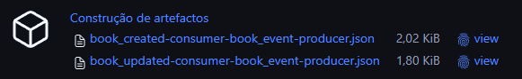
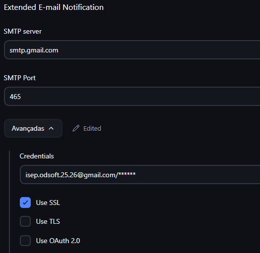
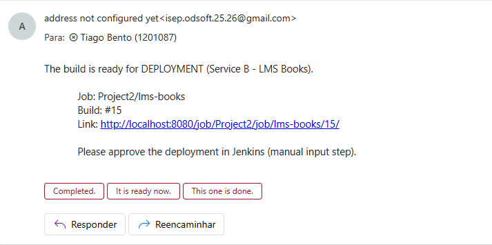

# CI/CD Pipeline Report – LMS AuthN & Users Service

## Overview
This project implements a fully automated CI/CD pipeline using Jenkins, Maven, Docker, and Docker Compose for the LMS AuthN & Users microservice.

## Pipeline stages

### Source code checkout and Build
The pipeline starts by checking out a Github repository and compiling the project using Maven

### Static Code Analysis
Static code analysis is executed during the pipeline to ensure code quality and detect potential issues early.

Checkstyle is used to enforce coding standards and consistency, while SpotBugs performs static analysis to identify common programming errors and potential bugs.

The analysis reports are collected and published by Jenkins.

### Unit Testing and Code Coverage 
Unit tests are executed using JUnit, and the test results are automatically published in Jenkins.
Code coverage is measured with JaCoCo, using defined quality gates for line and branch coverage. If the thresholds are not met, the build is marked as unstable.

### Mutation Testing
Mutation testing is performed using PIT, which validates the effectiveness of the test suite by introducing artificial faults.
An HTML report is published.

### CDC Testing
During this stage, the CDC Definition Test is executed, where two contract definition tests are successfully validated, ensuring that the expected consumer interactions are correctly defined.

Afterwards, provider-side CDC verification tests are executed, and Pact files are generated based on these interactions.
All generated Pact files are archived as Jenkins artifacts with fingerprinting enabled, ensuring traceability and serving as evidence of successful CDC validation.

### Docker Image build
In this stage the application is containerized with the latest tag

### Docker Login and Image Push
Through the pipeline we push the image to dockerhub, so it is public and we can retrieve it in the latest stages for production.

### Staging Deployment (Local)
With Docker Compose we deploy the application locally together with its dependencies, like Postgres and RabbitMQ, here we stop the previous containers rebuild and start the new services

### (Books service only) Email and manual approval
An SMTP server was configured in Jenkins using a dedicated email account `isep.odsoft.25.26@gmail.com`, created exclusively for CI/CD notifications.

The email credentials were securely configured in Jenkins and used by the pipeline through the `Email Extension Plugin`.

After all build, test stages complete successfully, the pipeline sends an automatic email notification to the designated approver with the job details and build link. The pipeline then pauses and waits for manual approval inside Jenkins.

### Remote Deployment Via SSH